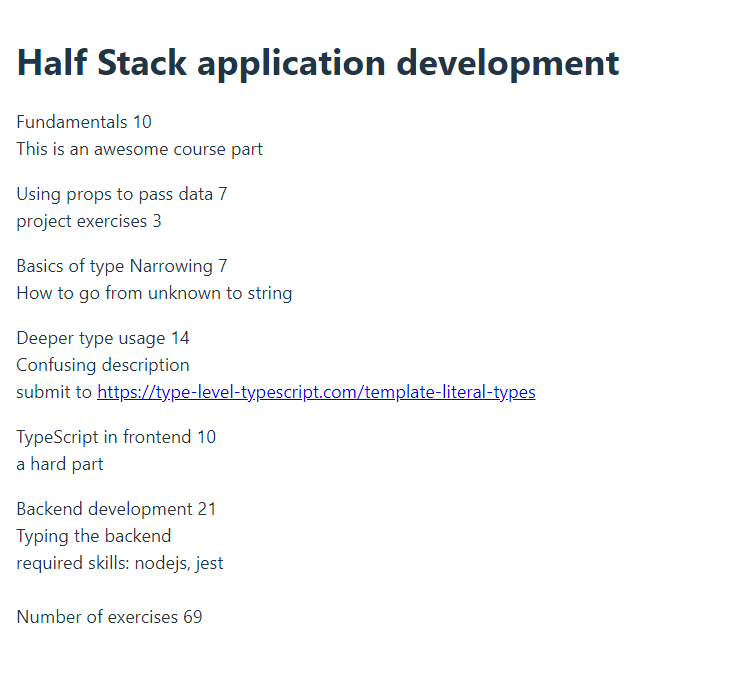

# React + TypeScript + Vite

Learning React with Types

- components
- interfaces, type unions

## Run this app

install node modules:

```shell
npm install
```

run the app

```shell
npm run dev
```

follow the terminals link or write
http://localhost:5173/ in your browser

## Pictures


