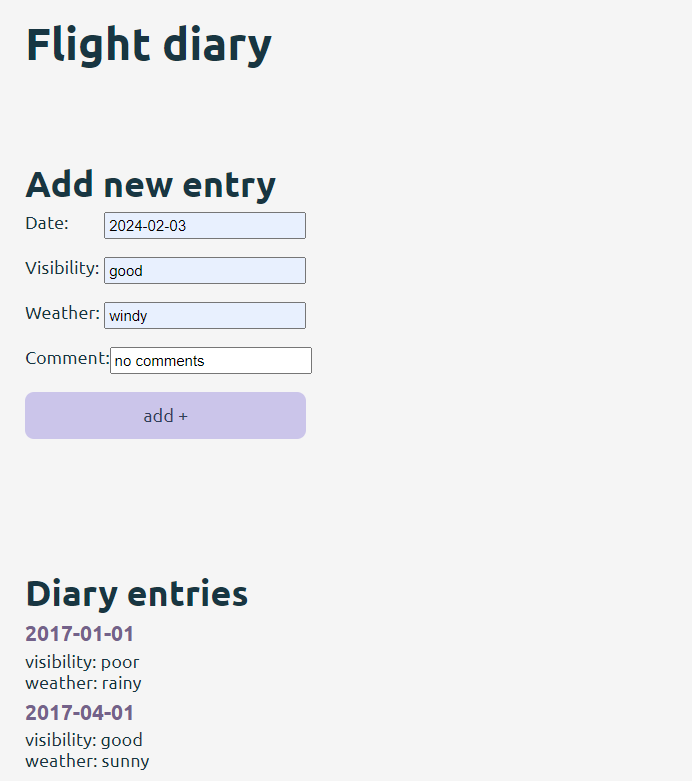
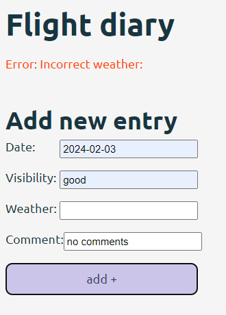

# Flight-diary

Application for adding entries to flight diary.
Frontend build with React + TypeScript + Vite for ready backend
Exercise 9.16 - 9.18 (9.19. to enter data with radio buttons and ready calendar not done)

## To run this app

Install node modules to front- and backend

```shell
npm install
```

Run backend on port 3000

```shell
npm run dev
```

Run frontend and open in browser (localhost:5173)

```shell
npm run dev
```

## Pictures of ready app



