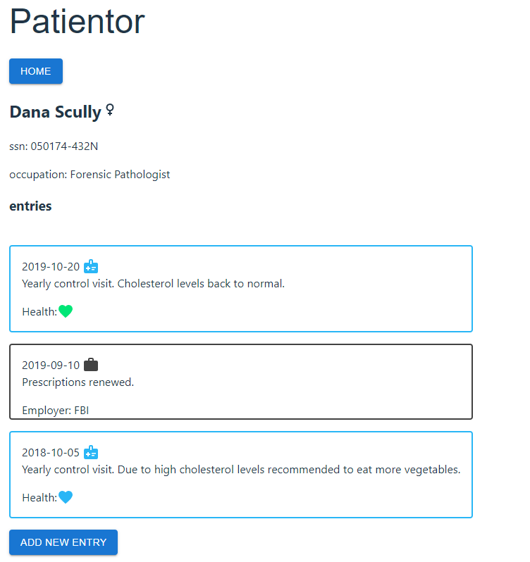
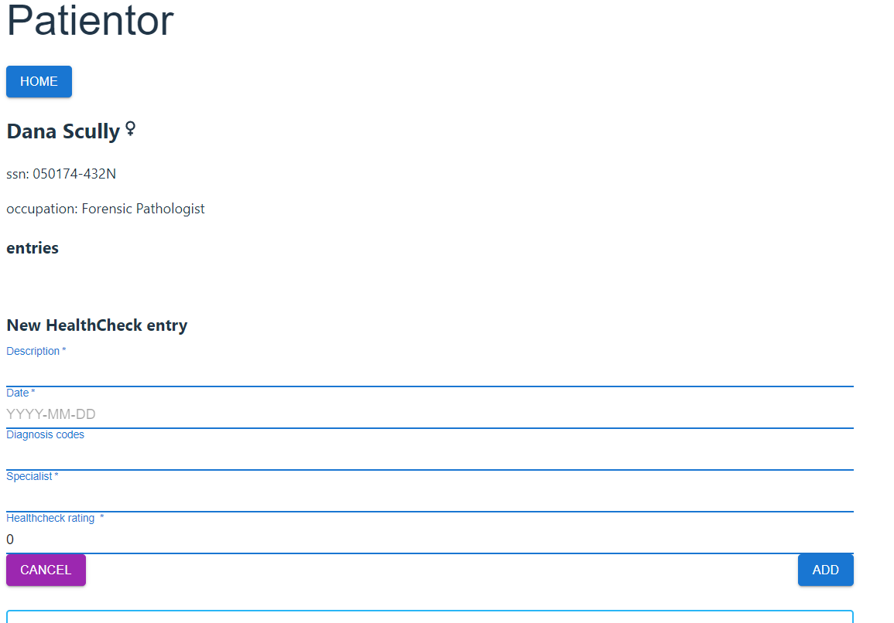

# Patientor

This project was to build backend for and modify by adding parts to ready frontend.
Patientor is a simple medical record app for doctors who handle diagnoses and basic health information of their patients.
Learned more confidence to create the backend and connect front with back and of course a lot of TypeScript. Normally I use pure CSS for frontend, but in this app I also used Material UI.

## To run the app

install node modules to both back and frontend

```shell
npm install
```

Get both front and backedn runing by

```shell
npm run dev
```

- frontend will be runing on port 5173 and backend on 3001

## What you can do with this app

You can add new patients and create new entries.
In this version you can add only Health Check entries (...maybe later also Occupational Helath check and Hospital Entries)

## Pictures of the app



